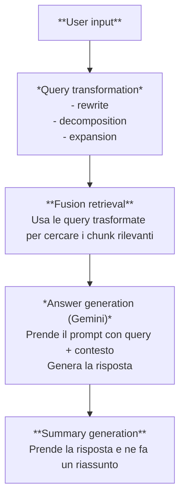

# 🚀 Sistema RAG Avanzato

Un sistema di Retrieval-Augmented Generation (RAG) modulare che integra tecniche avanzate per il processing, chunking, retrieval e generazione di risposte da documenti tecnici.

## 🎯 Caratteristiche Principali
### 🏗️ Architettura Modulare
```
src/
├── document_processing/    # PDF processor (Docling)
├── chunking/              # Semantic chunking
├── query_handling/        # HyPE processor
├── retrieval/             # Fusion retrieval
├── generation/            # Gemini generator
├── pipeline/              # Pipeline principale
├── telemetry/             #Telemetria con Langfuse
└── utils/                 # Utilità e helpers
```

## 🛠️ Installazione

### 1. Clona il repository
```bash
git clone <repository-url>
cd RAG-evaluator
```

### 1.1 Crea e attiva un ambiente virtuale (Consigliato)
```bash
python -m venv venv
venv\Scripts\activate
```

### 2. Installa le dipendenze
```bash
pip install -r requirements.txt
```

### 3. Configura le API Keys
Crea un file `.env` nella root del progetto:
```env
GOOGLE_API_KEY=your_google_gemini_api_key_here

LANGFUSE_PUBLIC_KEY="pk-lf-..."
LANGFUSE_SECRET_KEY="sk-lf-..."

# Opzionale (per modelli privati Hugging Face o limiti più alti):
HF_API_TOKEN=your_hf_token_here
```

### 4. Quick test dei componenti
```bash
python quick_test.py
```

### 6. Esecuzione dell'applicativo
```bash
python main.py --docs data/ --interactive
```

## 📋 Flusso di Esecuzione

### 0. Document Processing
- **Input**: PDF, TXT, MD
- **Processo**: Estrazione testo con Docling e conversione in Markdown semplice
- **Output**: Documenti processati con metadati

Nota: Processing del documento eseguibile in back office 

### 1. Semantic Chunking
- **Input**: Testo processato
- **Processo**: LangChain SemanticChunker divide il testo in chunks semanticamente coerenti
- **Parametri**: `percentile`, `standard_deviation`, `interquartile`
- **Output**: Chunks con boundaries semantiche naturali con limitazioni sui chunk size

Nota: Chunking eseguibile in back office

### 2. Query Handling (Query transformation)
- **Input**: Query utente
- **Processo**: Trasforma la query in altre queries con metodo di decomposizione in sub-queries (di numero {max_transformations}), riformulazione o step-back
- **Benefici**: Migliora la qualità e la precisione della ricerca
- **Output**: {max_transformations} queries

### 3. Fusion Retrieval
- **Input**: Query utente + indici costruiti
- **Processo**: Combina ricerca vettoriale (FAISS) e keyword (BM25)
- **Formula**: `score = α × vector_score + β × bm25_score`
- **Output**: Risultati ranked con score fusion

Nota: Indicizzazioni eseguibili in back office

### 4. Generation
- **Input**: Query + chunks recuperati
- **Processo**: Google Gemini genera risposta basata sul contesto
- **Output**: Risposta strutturata con fonti e confidence

### 5. Summary
- **Input**: Query + Risposta LLM
- **Processo**: Google Gemini genera riassunto basato sul contesto
- **Output**: Riassunto generato anche salvato in un file json (sovrascrivibile)



## Telemetry (Langfuse)
- **Info**: Segue il workflow dell'applicativo tramite context management
- **Benefici**: Aggiunge il tracciamento del workflow dell'applicativo e delle chiamate al LLM

Nota: per utilizzare Langfuse, è necessario avere un account su Langfuse e configurare le API keys in .env